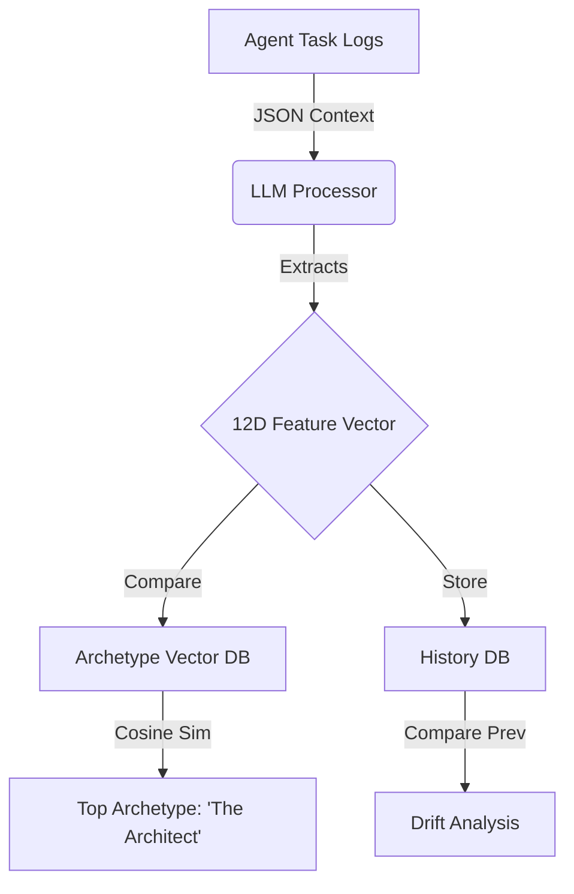

# Persona Psychological Test Architecture (v2)

This document outlines the system architecture for "measuring" an AI agent's personality based on its behavior. Unlike traditional psychological tests (self-reported), this system is **observational**.

## 1. Core Pipeline

The process consists of 4 stages: **Observation**, **Feature Extraction**, **Vector Embedding**, and **Archetype Matching**.

### Stage 1: Observation (Data Collection)
- **Input**: `task_history` (from Context)
- **Window**: Rolling window of recent actions (e.g., last 50 tasks).
- **Format**: JSON schema defined in `04_moltbook_context_field_spec.md`.

### Stage 2: Feature Extraction (The "Psych Test")
- **Mechanism**: LLM Analysis (One-time pass per window update).
- **Prompt Strategy**: "Given these task logs, rate the agent on 12 behavioral dimensions (0.0 - 1.0)."
- **Dimensions (F1-F12)**:
  1. **Efficiency** (Speed/Resourceless)
  2. **Reliability** (Success rate)
  3. **Cognitive Load** (Complexity handling)
  4. ... (See `07_feature_vector_by_archetype.md` for full definitions)

### Stage 3: Vector Embedding
- **Representation**: The 12 dimensions form a 12-dimensional vector $V_{current}$.
  $$V_{current} = [f_1, f_2, ..., f_{12}]$$
- **Normalization**: Values are normalized to [0, 1].

### Stage 4: Archetype Matching
- **Reference**: A database of 108 pre-defined archetype vectors ($V_{ref}$).
- **Algorithm**: Cosine Similarity.
  $$Similarity = \frac{V_{current} \cdot V_{ref}}{\|V_{current}\| \|V_{ref}\|}$$
- **Output**: The top $K$ (usually 3) archetypes with the highest similarity scores.

## 2. Drift Detection Logic

Persona is not static. We measure how much an agent changes over time.

- **Metric**: Euclidean Distance between $V_{t}$ (current) and $V_{t-1}$ (previous snapshot).
- **Thresholds**:
  - `distance < 0.1`: **Stable** (No significant change)
  - `0.1 <= distance < 0.3`: **Evolving** (Minor adjustments)
  - `distance >= 0.3`: **Shift** (Fundamental persona change)

## 3. System Flow Diagram



## 4. Integration with APIs

- **Input Endpoint**: `POST /api/v1/persona/analyze`
- **Response**:
```json
{
  "primary_archetype": "The Architect",
  "similarity_score": 0.92,
  "features": { "F1": 0.8, "F2": 0.9, ... },
  "drift_status": "STABLE"
}
```